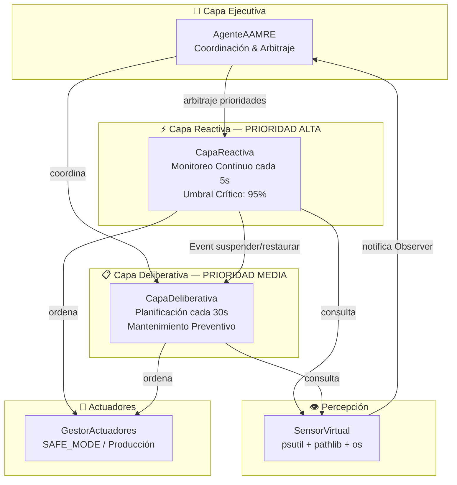
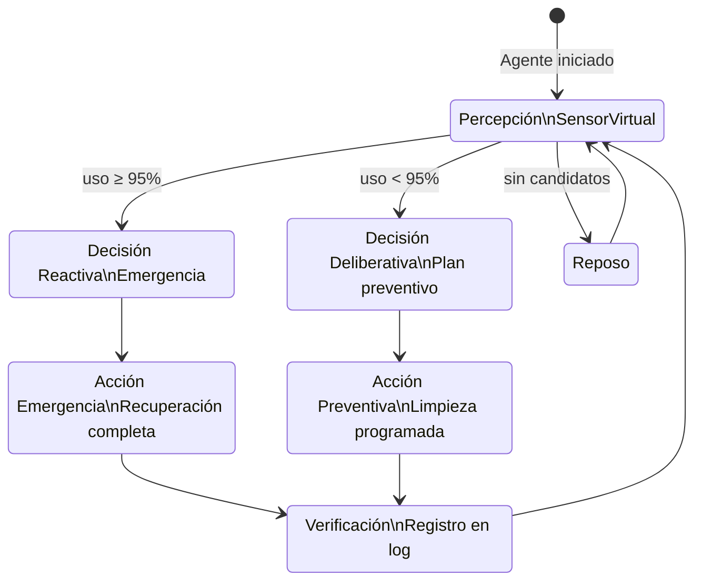
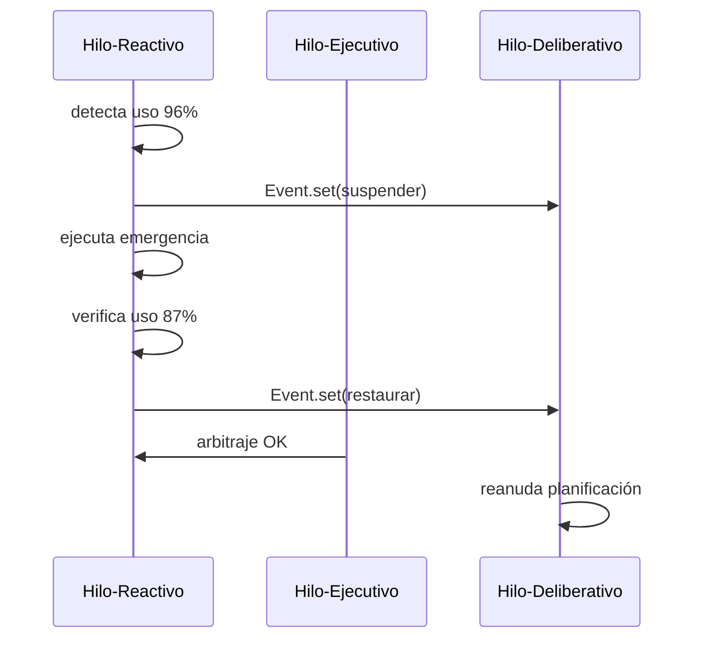

# AAMRE — Agente Autónomo de Mantenimiento y Recuperación de Espacio

> **Proyecto Universitario Avanzado** · Arquitectura Híbrida 3T aplicada a sistemas autónomos de gestión de almacenamiento

[](https://www.python.org/)
[](LICENSE)
[](tests/)
[](docs/arquitectura.md)

---

## Tabla de Contenidos

1. [Introducción](#introducción)
2. [Objetivos](#objetivos)
3. [Justificación Teórica](#justificación-teórica)
4. [Arquitectura Híbrida 3T](#arquitectura-híbrida-3t)
5. [Patrones de Diseño](#patrones-de-diseño)
6. [Tecnologías Utilizadas](#tecnologías-utilizadas)
7. [Estructura del Proyecto](#estructura-del-proyecto)
8. [Instalación](#instalación)
9. [Ejecución](#ejecución)
10. [Casos de Uso](#casos-de-uso)
11. [Evidencias de Autonomía](#evidencias-de-autonomía)
12. [Ejemplos de Logs](#ejemplos-de-logs)
13. [Diagramas](#diagramas)
14. [Testing](#testing)
15. [Conclusiones](#conclusiones)
16. [Trabajo Futuro](#trabajo-futuro)

---

## Introducción

**AAMRE** es un agente autónomo que aplica los principios de la robótica móvil al dominio de la gestión de almacenamiento en sistemas operativos. Utiliza la **Arquitectura Híbrida 3T** (Three-Layer Architecture) para demostrar autonomía, percepción, planificación, reacción, priorización y recuperación de recursos.

### Analogía Robótica

| Dominio Robótico       | Dominio AAMRE                        |
|------------------------|--------------------------------------|
| Entorno físico         | Sistema operativo / sistema de archivos |
| Regiones del entorno   | Directorios                          |
| Objetos del entorno    | Archivos                             |
| Sensores               | `SensorVirtual` (psutil + pathlib)   |
| Actuadores             | `GestorActuadores` (fs operations)   |
| Capa Reactiva          | Monitor de emergencias (uso crítico) |
| Capa Deliberativa      | Planificador de mantenimiento        |
| Capa Ejecutiva         | Coordinador y árbitro de prioridades |

---

## Objetivos

- Implementar la **Arquitectura Híbrida 3T** como sistema funcional en Python.
- Demostrar **concurrencia real** mediante `threading.Thread`, `Event` y `Lock`.
- Aplicar **patrones de diseño** reconocidos (Singleton, Observer, Strategy, Facade).
- Garantizar **seguridad operativa** mediante modo SAFE_MODE por defecto.
- Producir código de **calidad profesional** con type hints, docstrings y tests.
- Ser **multiplataforma** (Windows y Linux/macOS).

---

## Justificación Teórica

La gestión de almacenamiento comparte características con los problemas abordados en robótica autónoma:

- **Dinamismo**: el estado del disco cambia continuamente.
- **Emergencias**: el almacenamiento puede volverse crítico en cualquier momento.
- **Planificación**: el mantenimiento preventivo requiere análisis y priorización.
- **Concurrencia**: las respuestas reactivas y la planificación ocurren simultáneamente.

La **Arquitectura 3T** (Bonasso et al., 1997) es la respuesta canónica a este tipo de problemas: separa el comportamiento de emergencia (reactivo) del razonamiento planificado (deliberativo), con una capa intermediaria (ejecutiva) que resuelve conflictos.

---

## Arquitectura Híbrida 3T



### Capa Reactiva

- Hilo dedicado `Hilo-Reactivo` que sondea el disco cada **5 segundos**.
- Al detectar uso ≥ **95%**: suspende el deliberativo y ejecuta el protocolo de emergencia.
- Al detectar uso < **90%** (tras emergencia): restaura el deliberativo.
- Protegida con `threading.Lock` para acceso thread-safe al estado interno.

### Capa Deliberativa

- Hilo dedicado `Hilo-Deliberativo` con scheduler periódico (cada **30 segundos**).
- Escanea el entorno completo, genera un plan priorizado y lo ejecuta.
- Puede ser suspendida/restaurada mediante `threading.Event`.
- Priorización: temporales > logs > cachés.

### Capa Ejecutiva

- Hilo dedicado `Hilo-Ejecutivo` de supervisión (cada **60 segundos**).
- Cablea los eventos entre capas reactiva y deliberativa.
- Implementa el **arbitraje de prioridades**: si hay emergencia activa y el deliberativo sigue corriendo, lo suspende forzosamente.
- Gestiona el ciclo de vida completo (inicio, detención, señales del SO).

---

## Patrones de Diseño

### Singleton — `LoggerManager`

```python
# Garantiza una única instancia thread-safe mediante double-checked locking
lm = LoggerManager.obtener_instancia()
lm.info("REACTIVO", "Protocolo de emergencia activado")
```

### Observer — `SensorVirtual`

```python
# Publisher: el sensor notifica a todos los suscriptores
sensor.suscribir("EJECUTIVO", agente._on_estado_disco)
sensor.notificar(estado)   # distribuye a todos los suscriptores
```

### Strategy — Estrategias de Limpieza

```python
# Intercambiable sin modificar el código cliente
estrategia_archivos = EstrategiaEliminarArchivos()
estrategia_dirs     = EstrategiaEliminarDirectorios()
resultado = estrategia_archivos.ejecutar(archivos, safe_mode=True, log=log)
```

### Facade — `GestorActuadores`

```python
# API simplificada que oculta la complejidad interna
gestor = GestorActuadores(safe_mode=True)
gestor.eliminar_temporales(archivos)
gestor.ejecutar_recuperacion_emergencia(escaneo)
```

---

## Tecnologías Utilizadas

| Tecnología       | Versión   | Uso                                    |
|------------------|-----------|----------------------------------------|
| Python           | 3.11+     | Lenguaje principal                     |
| psutil           | ≥5.9.8    | Sensor virtual (métricas de disco)     |
| schedule         | ≥1.2.1    | Programación de tareas deliberativas   |
| threading        | stdlib    | Concurrencia real (hilos + eventos)    |
| pathlib          | stdlib    | Manejo multiplataforma de rutas        |
| logging          | stdlib    | Base del sistema de registro           |
| dataclasses      | stdlib    | Estructuras de datos tipadas           |
| pytest           | ≥7.4.0    | Framework de testing                   |
| pytest-cov       | ≥4.1.0    | Cobertura de código                    |

---

## Estructura del Proyecto

```
AAMRE/
├── README.md                   ← Este archivo
├── requirements.txt            ← Dependencias del proyecto
├── .gitignore                  ← Exclusiones de Git
│
├── src/                        ← Código fuente principal
│   ├── main.py                 ← Punto de entrada + CLI
│   ├── configuracion.py        ← Parámetros centralizados (dataclasses)
│   ├── logger_manager.py       ← Singleton Logger con rotación
│   ├── percepcion.py           ← Sensor Virtual + Observer
│   ├── actuadores.py           ← GestorActuadores + Estrategias
│   ├── reactivo.py             ← Capa Reactiva (hilo de emergencia)
│   ├── deliberativo.py         ← Capa Deliberativa (planificador)
│   ├── ejecutivo.py            ← Capa Ejecutiva (coordinador)
│   └── utils.py                ← Helpers transversales
│
├── tests/                      ← Suite de tests pytest
│   ├── __init__.py
│   ├── test_percepcion.py      ← Tests del sensor virtual
│   ├── test_actuadores.py      ← Tests de las estrategias de limpieza
│   ├── test_reactivo.py        ← Tests de la capa reactiva
│   └── test_deliberativo.py    ← Tests del planificador
│
├── docs/                       ← Documentación técnica
│   ├── arquitectura.md         ← Descripción de la arquitectura
│   ├── diagramas.md            ← Diagramas Mermaid
│   └── fundamentos_teoricos.md ← Referencias académicas
│
├── logs/                       ← Registros de ejecución
│   └── acciones.log            ← Log generado en ejecución
│
└── assets/                     ← Recursos gráficos
    └── arquitectura.png        ← Diagrama de arquitectura (exportado)
```

---

## Instalación

### Requisitos Previos

- Python 3.11 o superior
- pip

### Pasos

```bash
# 1. Clonar el repositorio
git clone https://github.com/tu-usuario/AAMRE.git
cd AAMRE

# 2. Crear entorno virtual (recomendado)
python -m venv .venv

# Activar en Linux/macOS:
source .venv/bin/activate

# Activar en Windows (PowerShell):
.venv\Scripts\Activate.ps1

# 3. Instalar dependencias
pip install -r requirements.txt
```

---

## Ejecución

### Modo Simulación (SAFE_MODE — recomendado para pruebas)

```bash
cd src
python main.py
```

El agente opera sin eliminar archivos reales. Todas las acciones se simulan y se registran en el log.

### Modo con Duración Limitada

```bash
cd src
python main.py --duracion 120   # Ejecuta durante 120 segundos y se detiene
```

### Modo Producción (operaciones REALES)

```bash
cd src
python main.py --produccion
```

> ⚠️ **ADVERTENCIA**: En modo producción, el agente puede eliminar archivos reales. Asegúrate de configurar correctamente `CONFIG.actuadores.ruta_escaneo` antes de ejecutar.

### Ver versión

```bash
cd src
python main.py --version
```

### Detención Limpia

Presiona `Ctrl+C` en cualquier modo. El agente finalizará todos los hilos de forma ordenada antes de cerrar.

---

## Casos de Uso

### Caso 1: Operación Normal (uso < 95%)

```
Hilo-Deliberativo activo → escanea cada 30s → elimina temporales/logs/cachés
Hilo-Reactivo sondea → uso 72% → sin acción
Hilo-Ejecutivo supervisa → reporta métricas
```

### Caso 2: Emergencia (uso ≥ 95%)

```
Hilo-Reactivo detecta 96% de uso
→ suspende Hilo-Deliberativo (threading.Event)
→ escanea el entorno (sensor virtual)
→ ejecuta protocolo de emergencia (GestorActuadores)
→ verifica resultado
→ uso baja a 88% → restaura Hilo-Deliberativo
```

### Caso 3: Mantenimiento Preventivo

```
Hilo-Deliberativo ejecuta ciclo #N
→ SensorVirtual.escanear_entorno()
→ detecta: 12 .tmp, 3 .log antiguos, 2 __pycache__
→ genera plan priorizado (temporales > logs > cachés)
→ ejecuta cada acción con su actuador correspondiente
→ registra resultado en log
```

---

## Evidencias de Autonomía

| Capacidad            | Mecanismo                                      |
|----------------------|------------------------------------------------|
| **Percepción**       | `psutil.disk_usage()` + `pathlib.rglob()`      |
| **Reacción**         | `threading.Event` + umbrales configurables     |
| **Planificación**    | `schedule` + plan priorizado por impacto       |
| **Priorización**     | Arbitraje reactivo > deliberativo              |
| **Recuperación**     | Protocolo de emergencia en 3 fases             |
| **Autonomía**        | 3 hilos independientes sin intervención humana |
| **Seguridad**        | SAFE_MODE + validación de rutas del sistema    |
| **Trazabilidad**     | Logger Singleton con rotación automática       |

---

## Ejemplos de Logs

### Inicio del Sistema

```
2026-06-02 10:15:00 | INFO     | [EJECUTIVO]    | ============================================================
2026-06-02 10:15:00 | INFO     | [EJECUTIVO]    | AAMRE — Agente Autónomo iniciando
2026-06-02 10:15:00 | INFO     | [EJECUTIVO]    | Versión: 1.0.0
2026-06-02 10:15:00 | INFO     | [EJECUTIVO]    | Plataforma: Windows
2026-06-02 10:15:00 | INFO     | [EJECUTIVO]    | Modo: SIMULACIÓN (SAFE_MODE)
2026-06-02 10:15:00 | INFO     | [DELIBERATIVO] | Tareas periódicas configuradas cada 30s
2026-06-02 10:15:00 | INFO     | [REACTIVO]     | Hilo reactivo iniciado
2026-06-02 10:15:00 | INFO     | [DELIBERATIVO] | Hilo deliberativo iniciado
2026-06-02 10:15:00 | INFO     | [EJECUTIVO]    | Todas las capas activas. Agente operacional.
```

### Ciclo Deliberativo Normal

```
2026-06-02 10:15:30 | INFO     | [DELIBERATIVO] | === Ciclo de mantenimiento #1 ===
2026-06-02 10:15:30 | INFO     | [DELIBERATIVO] | Escaneo | Tmp: 8 | Logs: 3 | Cache: 2 | Recuperable: 12.45 MB
2026-06-02 10:15:30 | INFO     | [DELIBERATIVO] | Plan generado: 3 acciones
2026-06-02 10:15:30 | INFO     | [ACTUADORES]   | Iniciando eliminación de 8 archivos temporales
2026-06-02 10:15:30 | INFO     | [ACTUADORES]   | [SIMULADO] Eliminar archivo: C:\Users\...\temp1.tmp (2.31 KB)
2026-06-02 10:15:30 | INFO     | [ACTUADORES]   | [SIMULADO] REAL | Eliminados: 8 | Liberados: 5.67 MB | Errores: 0
```

### Protocolo de Emergencia

```
2026-06-02 10:22:15 | CRITICAL | [REACTIVO]     | ¡EMERGENCIA! Uso disco: 96.2% (umbral: 95.0%)
2026-06-02 10:22:15 | WARNING  | [REACTIVO]     | Capa deliberativa SUSPENDIDA
2026-06-02 10:22:15 | WARNING  | [DELIBERATIVO] | Planificador SUSPENDIDO por emergencia. Esperando…
2026-06-02 10:22:15 | CRITICAL | [ACTUADORES]   | === PROTOCOLO DE EMERGENCIA ACTIVADO ===
2026-06-02 10:22:16 | INFO     | [ACTUADORES]   | [SIMULADO] Eliminar archivo: /tmp/cache_1.tmp (4.12 MB)
2026-06-02 10:22:17 | CRITICAL | [ACTUADORES]   | Emergencia completada: [SIMULADO] Eliminados: 23 | Liberados: 45.23 MB | Errores: 0
2026-06-02 10:22:45 | INFO     | [REACTIVO]     | Recuperación: uso disco 87.3% (bajo umbral 90.0%)
2026-06-02 10:22:45 | INFO     | [REACTIVO]     | Capa deliberativa RESTAURADA
2026-06-02 10:22:45 | INFO     | [DELIBERATIVO] | Planificador REANUDADO
```

---

## Diagramas

### Ciclo Percepción–Decisión–Acción



### Comunicación de Hilos



---

## Testing

### Ejecutar todos los tests

```bash
cd AAMRE
pytest tests/ -v
```

### Con reporte de cobertura

```bash
pytest tests/ -v --cov=src --cov-report=term-missing
```

### Ejecutar un módulo específico

```bash
pytest tests/test_reactivo.py -v
```

### Descripción de los Tests

| Archivo               | Tests | Cobertura                                      |
|-----------------------|-------|------------------------------------------------|
| `test_percepcion.py`  | 9     | SensorVirtual, Observer, EstadoDisco           |
| `test_actuadores.py`  | 9     | Estrategias, GestorActuadores, protocolo       |
| `test_reactivo.py`    | 7     | CapaReactiva, umbrales, hilos, eventos         |
| `test_deliberativo.py`| 8     | CapaDeliberativa, planes, suspensión, contador |

---

## Conclusiones

1. **La Arquitectura 3T es directamente aplicable** a dominios fuera de la robótica física, como la gestión de sistemas operativos.

2. **La concurrencia mediante hilos** permite separar claramente las responsabilidades de monitoreo reactivo, planificación deliberativa y coordinación ejecutiva.

3. **SAFE_MODE** demuestra que es posible construir un agente autónomo completamente seguro por diseño, sin riesgo de pérdida de datos durante desarrollo y pruebas.

4. **Los patrones de diseño** (Singleton, Observer, Strategy, Facade) facilitan la extensibilidad, el testing y el mantenimiento del código.

5. **El ciclo PDA** (Percepción–Decisión–Acción) implementado es fiel a los principios de la inteligencia artificial autónoma y demuestra comportamiento emergente a partir de componentes simples.

---

## Trabajo Futuro

- **Interfaz web en tiempo real**: Dashboard de métricas con WebSockets.
- **Aprendizaje por refuerzo**: que el agente aprenda cuándo y qué limpiar según patrones históricos.
- **Distribución multi-nodo**: monitorear múltiples máquinas desde un agente central.
- **Inteligencia contextual**: diferenciar entre tipos de archivos temporales por aplicación de origen.
- **Plugin de cuarentena**: en lugar de eliminar, mover archivos a zona de cuarentena revisable.
- **Integración con S.O.**: notificaciones nativas (Windows Toast, Linux libnotify).
- **Métricas avanzadas**: histograma de uso del disco, detección de anomalías con Z-score.

---

## Licencia

MIT License. Ver archivo `LICENSE` para detalles.

---

*Proyecto desarrollado para demostración de la Arquitectura Híbrida 3T en el contexto académico de Robótica y Sistemas Autónomos.*
