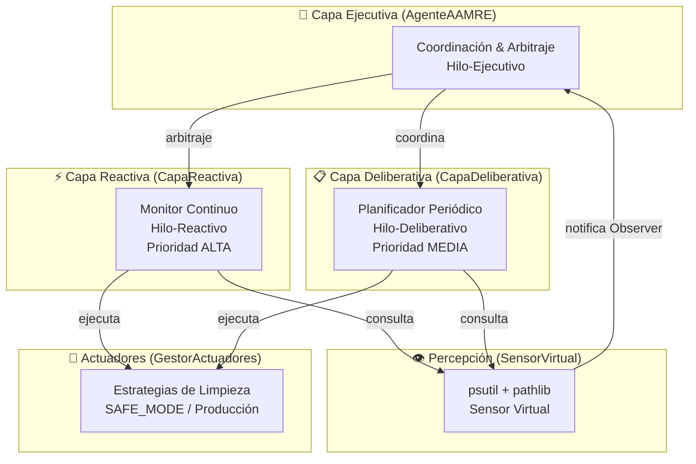
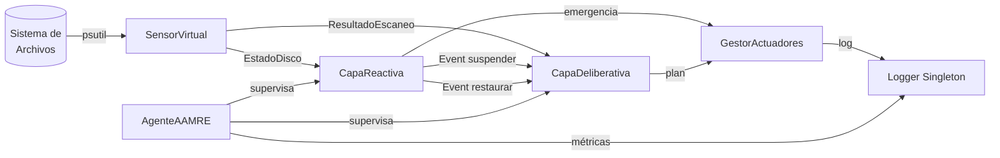
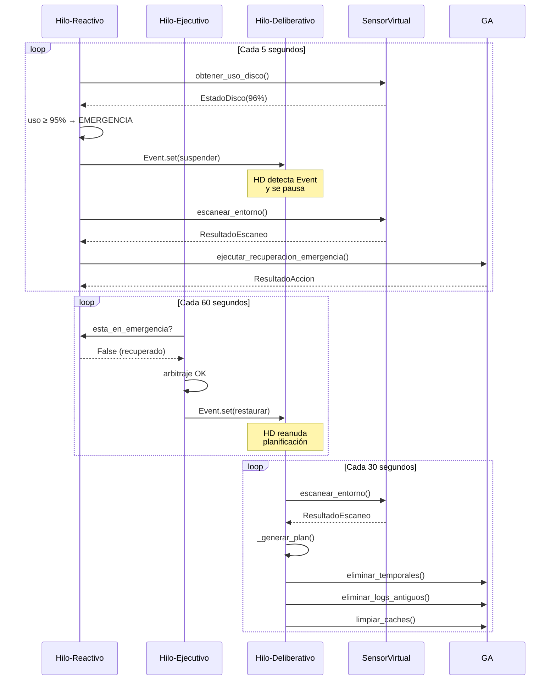
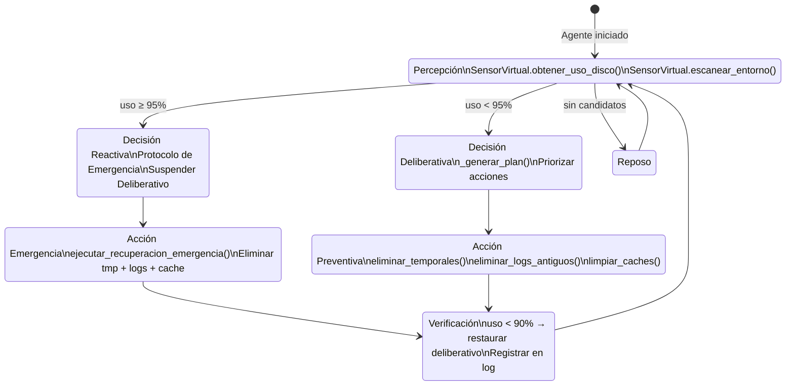
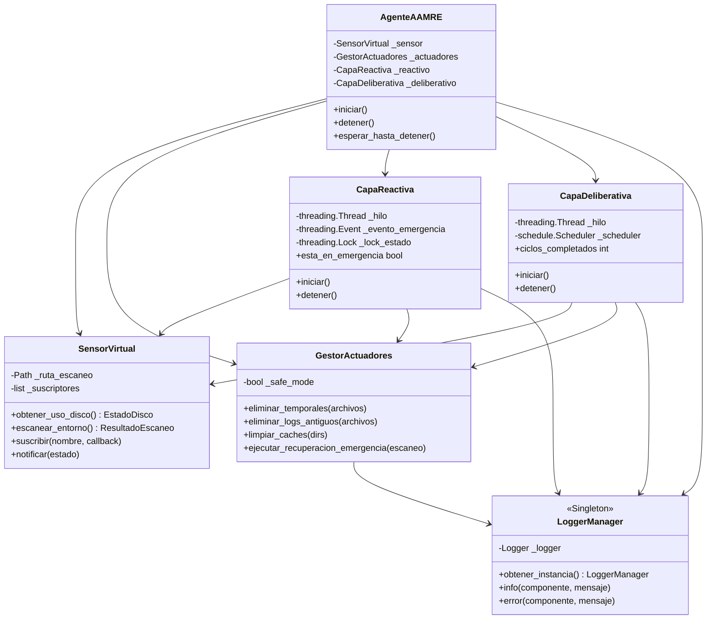

# Diagramas del Sistema — AAMRE

Todos los diagramas están escritos en **Mermaid** y se renderizan automáticamente en GitHub.

---

## 1. Arquitectura Híbrida 3T

---

## 2. Flujo de Datos del Sistema

---

## 3. Comunicación entre Hilos

---

## 4. Ciclo Percepción–Decisión–Acción (PDA)

---

## 5. Diagrama de Clases (simplificado)

